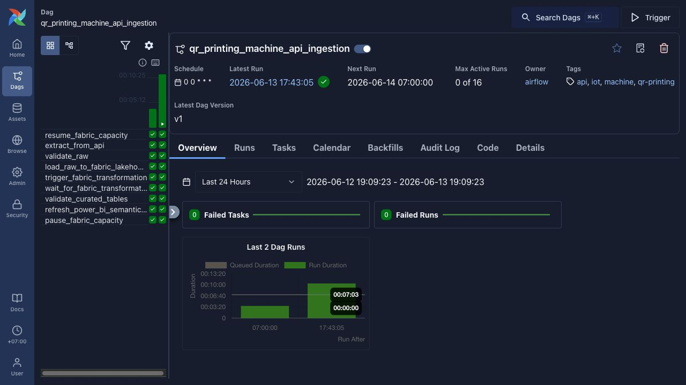
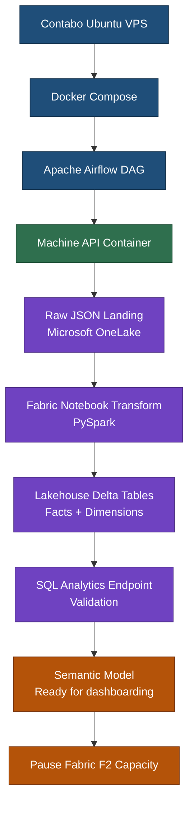
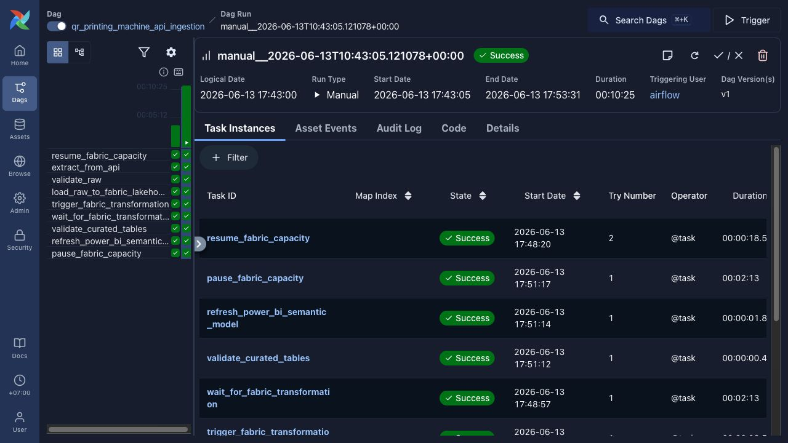
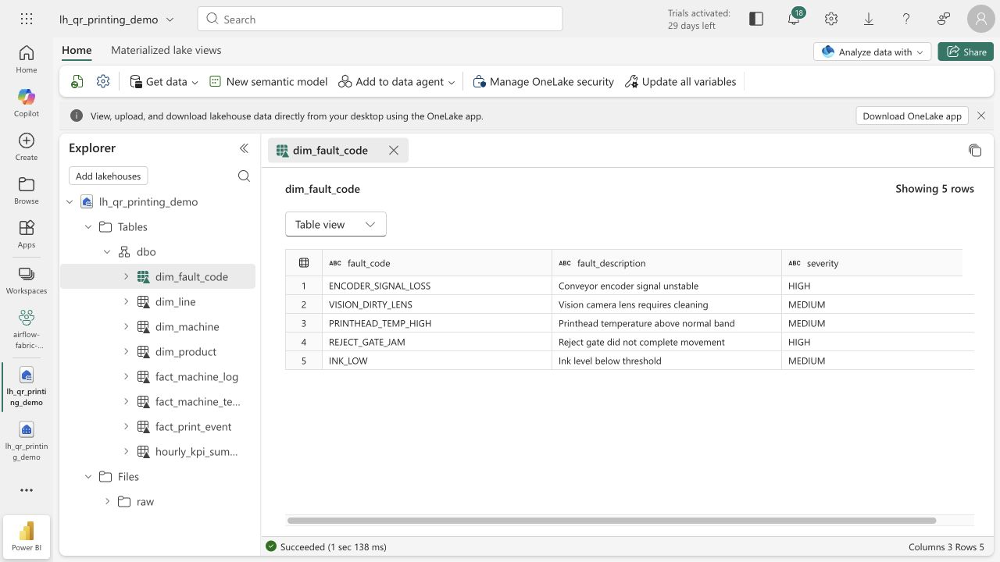
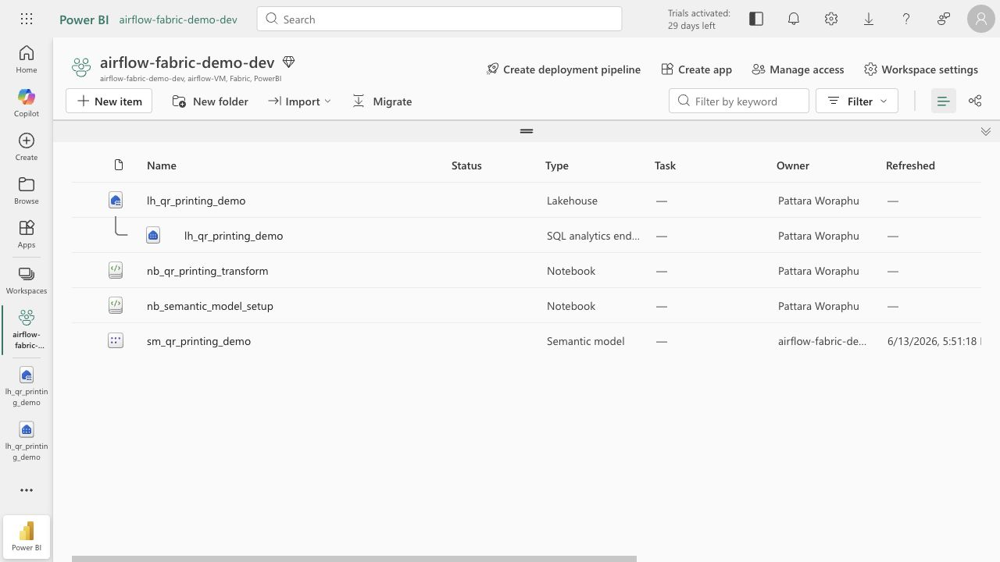
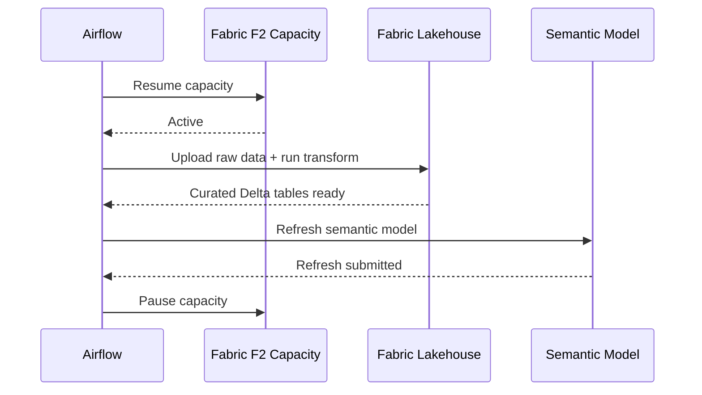
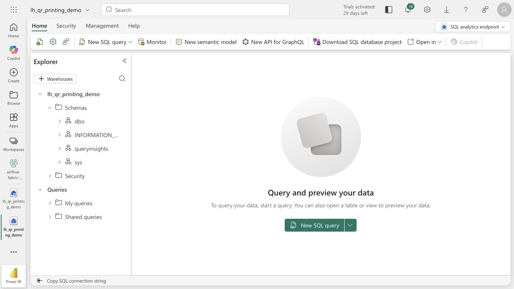

# Airflow + Microsoft Fabric Orchestration Demo

Production-style data engineering demo for orchestrating machine API ingestion, Microsoft Fabric Lakehouse transformation, curated Delta tables, and a semantic model ready for dashboarding.

The scenario is an industrial high-speed QR printing line for beverage bottle/can traceability. Each item receives a unique QR code, vision inspection validates print quality, and machine telemetry/logs support operational analytics.



## What This Demonstrates

- Apache Airflow as the orchestration layer for a daily data pipeline
- Dockerized services running on an Ubuntu VPS
- API extraction from a simulated industrial machine source
- Raw JSON landing in Microsoft Fabric OneLake / Lakehouse Files
- Fabric notebook transformation into curated Delta tables
- SQL analytics endpoint validation
- Semantic model refresh after data transformation
- Fabric F2 pause/resume automation for cost control

The project intentionally stops at a refreshed semantic model. A dashboard can be connected later, but the focus here is the governed pipeline that prepares reliable analytical data.

## Business Scenario

A beverage production line prints QR codes at high speed for traceability. The source system emits three types of data:

- `print_events`: one row per printed item, including QR result, vision result, reject flag, product, batch, and grade score
- `machine_telemetry`: one row per minute with speed, temperature, vibration, pressure, ink usage, and machine state
- `machine_logs`: fault and warning events such as reject gate jams, dirty vision lens, encoder signal loss, and printhead temperature alerts

The goal is to convert raw operational events into curated facts, dimensions, and semantic measures that can support production, quality, downtime, and machine-health analysis.

## Architecture



## Pipeline Workflow

The main DAG is `qr_printing_machine_api_ingestion`.


The DAG runs daily at `00:00 UTC / 07:00 Bangkok`, processes the previous 24-hour window, calls the source API once per hour, merges the responses, uploads one daily raw payload, triggers Fabric transformation, refreshes the semantic model, and pauses Fabric capacity afterward.



## Data Layers

| Layer | Purpose | Implementation |
| --- | --- | --- |
| Source | Simulated QR printing machine API | FastAPI container |
| Raw | Preserve API response by run/window | OneLake Lakehouse Files |
| Transform | Parse, clean, type, and model records | Fabric notebook / PySpark |
| Curated | Analytics-ready facts and dimensions | Fabric Lakehouse Delta tables |
| Validation | Confirm row availability and table readiness | Fabric SQL analytics endpoint |
| Semantic | Business measures and relationships | Semantic model ready for reports |

Curated tables include:

- `fact_print_event`
- `fact_machine_telemetry_minute`
- `fact_machine_log`
- `dim_machine`
- `dim_line`
- `dim_product`
- `dim_fault_code`
- `hourly_kpi_summary`



## Semantic Model Readiness

The semantic model is prepared with relationships and operational measures such as:

- OEE %
- Availability %
- Performance %
- Quality %
- QR Read Rate %
- Reject Rate %
- Items Processed
- Fault Count
- Average QR Grade Score
- Average Printhead Temperature C
- Average Vibration mm/s



## Cost-Control Design

Fabric F2 is billable while active, so the pipeline treats capacity as an orchestration dependency:



This keeps the demo suitable for learning and portfolio use without leaving Fabric compute running continuously.

## Tech Stack

- Apache Airflow
- Docker Compose
- Python
- FastAPI
- Microsoft Fabric Lakehouse
- Microsoft OneLake
- Fabric notebooks / PySpark
- Delta tables
- Fabric SQL analytics endpoint
- Semantic model
- Azure Entra service principal
- Azure ARM API for Fabric F2 pause/resume
- Ubuntu VPS

## Screenshots





## Project Files

```text
dags/qr_printing_machine_api_dag.py       Airflow orchestration DAG
machine_api/app.py                        Simulated QR printing machine API
fabric/notebooks/qr_printing_transform.py Fabric transformation notebook source
fabric/notebooks/semantic_model_setup.py  Semantic model setup notebook source
docker-compose.yaml                       Local/VPS Airflow stack
.env.example                              Required environment variable template
```

## Further Documentation

- [PROJECT_DETAILS.md](PROJECT_DETAILS.md): full concept, architecture notes, domain design, and phase plan
- [PROJECT_STATUS.md](PROJECT_STATUS.md): current implementation state, fixes, caveats, costs, and next steps
- [FABRIC_CLEANUP_INVENTORY.md](FABRIC_CLEANUP_INVENTORY.md): Fabric workspace, capacity, budget, and cleanup inventory

## Current Status

The pipeline has been tested end-to-end from Airflow on the VPS through Fabric transformation and semantic model refresh. The current focus is orchestration and data platform readiness; dashboard design is intentionally left as a later layer.
